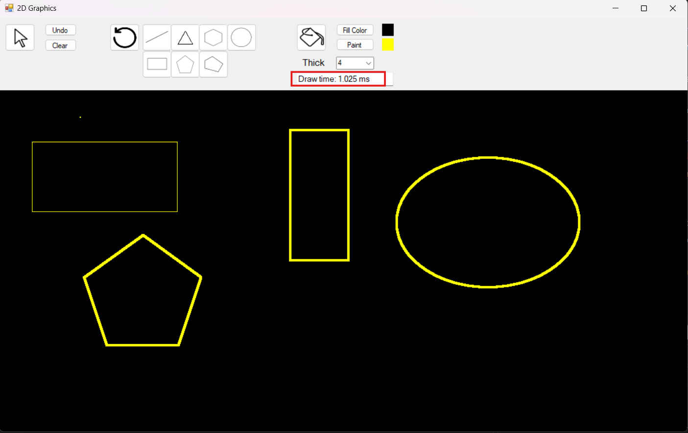

# Simple 2D Paint application using SharpGL C#

## Description
Application includes painting 2D shapes like line, triangle, rectangle, pentation, hexagon, ellipse, circle and polygon. User can paint or fill shapes with desired color.

## Instructions and Demos
- Click on shape buttons to choose a type of shape to draw.

https://github.com/SebastianKyle/2D_Graphics/assets/132763425/aa0b542b-4557-4af1-a56e-8aa65490269d

- For shapes including triangle, rectangle, ellipse, user holds 'Shift' key to draw equilateral triangle, square and circle, respectively.

https://github.com/SebastianKyle/2D_Graphics/assets/132763425/e12dfb56-4acc-41e8-abc2-572f4f56e17c

- For polygon shape, user continuously click on drawing area to define vertices of the polygon and click right mouse to define the final vertex.

https://github.com/SebastianKyle/2D_Graphics/assets/132763425/e4d11855-cbb2-43f4-b80d-dd9d046f98d8

- Cursor button allows user to choose shapes painted in drawing area. After selecting the shape, user can drag shape to desired position.

https://github.com/SebastianKyle/2D_Graphics/assets/132763425/e8dc1fe5-dfc6-4a64-9cc9-1eee6fe3e217

- The scaling functionality is activated by default. Drag the control points to scale shapes.

https://github.com/SebastianKyle/2D_Graphics/assets/132763425/33c2b029-170d-406e-84e5-5194b66b0418

- The rotating arrow button represents rotating functionality. Click on this button to enable rotating mode and rotate shapes by dragging the control points.

https://github.com/SebastianKyle/2D_Graphics/assets/132763425/84000c8c-bb4e-4ad8-ba0b-a56d8a8179f6

- Click on 'Fill Color' to choose color to fill in shape. User then click on the bucket button to fill that color in the selected shape.

https://github.com/SebastianKyle/2D_Graphics/assets/132763425/9a04c84f-1393-45c7-97a8-c53754443ee5

- Click on 'Paint Color' to choose color to paint a shape.

https://github.com/SebastianKyle/2D_Graphics/assets/132763425/5eed6dce-8836-45ed-bdd8-78960ae90ce1

- Click on the 'Thick' drop down to choose the thickness to draw shapes.

https://github.com/SebastianKyle/2D_Graphics/assets/132763425/99355d23-3f1b-4f12-aff7-34f044f1bd99

- The text area below thickness dropdown shows the draw time of the shape drawn recently.

- Click on 'Undo' to delete the latest drawn shape or the selected shape. Click on 'Clear' button to delete all shapes painted in drawing area.

https://github.com/SebastianKyle/2D_Graphics/assets/132763425/b7c475af-3808-4261-939a-12b0a1501e3b
